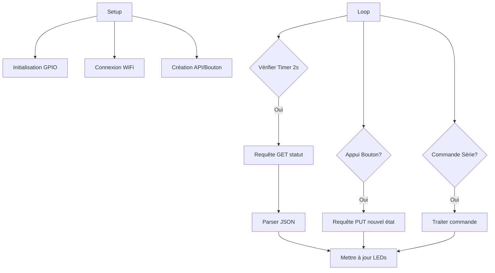

## Arborescence du Projet Client
Voici la structure optimisée qui réutilise vos fichiers existants tout en intégrant les nouvelles fonctionnalités :

```
Projet_Reactor_Client/
├── lib/
│   └── Bouton/              # Module recyclé sans modification
│       ├── Bouton.h
│       └── Bouton.cpp
├── src/
│   ├── ProgramClient.h       # Classe principale (nouvelle structure)
│   ├── ProgramClient.cpp
│   ├── API.h                 # Modifié depuis votre ébauche
│   ├── API.cpp
│   ├── ParseurJSON.h         # Nouveau module
│   ├── ParseurJSON.cpp
│   └── CommandesSerie.h      # Nouveau module
├── Projet_Reactor_Client.ino # Point d'entrée principal
└── platformio.ini            # Configuration du projet
```

## Modifications des Fichiers Existants

### 1. **Bouton.h/cpp** (inchangé)
```cpp
// Bouton.h (recyclé tel quel)
class Bouton {
    uint8_t mpin;
    bool mdernierEtat, mdernierEtatStable;
    unsigned long mderniereDateChangement, mdelaiAntiRebond;
    Action* mactionAppui, *mactionRelachement;
    
public:
    Bouton(uint8_t p_pin, unsigned long p_delaiAntiRebond);
    void MiseAJour();
    void SetActionAppui(Action* paction);
    bool EstAppuye() const;
};
```

### 2. **API.h/cpp** (modifié)
```cpp
// API.h
#include 
#include 

class API {
private:
    String m_url;
    
public:
    API(String purl);
    String getUrl() const;
    String lireStatut();
    bool changerStatut(const String& nouvelEtat);
};
```

```cpp
// API.cpp
#include "API.h"

API::API(String purl) : m_url(purl) {}

String API::getUrl() const { return m_url; }

String API::lireStatut() {
    HTTPClient http;
    http.begin(m_url);
    http.addHeader("Accept", "application/json");
    
    String payload = "";
    int httpCode = http.GET();
    if (httpCode == HTTP_CODE_OK) {
        payload = http.getString();
    }
    http.end();
    return payload;
}

bool API::changerStatut(const String& nouvelEtat) {
    HTTPClient http;
    http.begin(m_url);
    http.addHeader("Content-Type", "application/json");
    
    String json = "{\"etat\":\"" + nouvelEtat + "\"}";
    int httpCode = http.PUT(json);
    http.end();
    return (httpCode == HTTP_CODE_OK);
}
```

## Nouveaux Fichiers

### 3. **ParseurJSON.h/cpp**
```cpp
// ParseurJSON.h
#include 

class ParseurJSON {
public:
    static String extraireEtatReacteur(String json);
};
```

```cpp
// ParseurJSON.cpp
#include "ParseurJSON.h"

String ParseurJSON::extraireEtatReacteur(String json) {
    StaticJsonDocument doc;
    DeserializationError error = deserializeJson(doc, json);
    if (error) return "erreur";
    return doc["etat"].as();
}
```

### 4. **CommandesSerie.h**
```cpp
// CommandesSerie.h
class CommandesSerie {
public:
    static void traiter(String commande, API& api, String& etatReacteur);
};
```

```cpp
// CommandesSerie.cpp
#include "CommandesSerie.h"
#include "API.h"

void CommandesSerie::traiter(String commande, API& api, String& etatReacteur) {
    commande.trim();
    
    if (commande == "coeur-reacteur statut") {
        Serial.println("Etat actuel: " + etatReacteur);
    }
    else if (commande == "coeur-reacteur activer") {
        if (api.changerStatut("actif")) etatReacteur = "actif";
    }
    else if (commande == "coeur-reacteur desactiver") {
        if (api.changerStatut("repos")) etatReacteur = "repos";
    }
}
```

### 5. **ProgramClient.h/cpp** (Noyau principal)
```cpp
// ProgramClient.h
#include "Bouton.h"
#include "API.h"
#include "ParseurJSON.h"
#include "CommandesSerie.h"

class ProgramClient {
private:
    Bouton* m_bouton;
    API* m_api;
    unsigned long m_derniereVerification;
    const unsigned long INTERVALLE_VERIFICATION = 2000;
    String m_etatReacteur = "repos";
    
    // Configuration des pins
    const uint8_t PIN_BOUTON = 4;
    const uint8_t PIN_LED_VERTE = 2;
    const uint8_t PIN_LED_ROUGE = 5;
    
public:
    ProgramClient();
    void initialiser();
    void loop();
    
private:
    void verifierStatutReacteur();
    void gererAppuiBouton();
    void mettreAJourLEDs();
    void traiterCommandeSerie();
    void connexionReseau(); // Recyclé de votre code
};
```

```cpp
// ProgramClient.cpp
#include "ProgramClient.h"

ProgramClient::ProgramClient() 
    : m_bouton(new Bouton(PIN_BOUTON, 50)),
      m_api(new API("http://192.168.1.100/coeur-reacteur")) {}

void ProgramClient::initialiser() {
    Serial.begin(115200);
    pinMode(PIN_LED_VERTE, OUTPUT);
    pinMode(PIN_LED_ROUGE, OUTPUT);
    connexionReseau();
    mettreAJourLEDs();
}

void ProgramClient::loop() {
    unsigned long tempsActuel = millis();
    
    // Vérification périodique
    if (tempsActuel - m_derniereVerification >= INTERVALLE_VERIFICATION) {
        verifierStatutReacteur();
        m_derniereVerification = tempsActuel;
    }
    
    // Gestion bouton
    m_bouton->MiseAJour();
    if (m_bouton->EstAppuye()) {
        gererAppuiBouton();
    }
    
    // Gestion commande série
    if (Serial.available() > 0) {
        traiterCommandeSerie();
    }
}

// ... (implémentation des autres méthodes)
```

### 6. **Fichier Principal (.ino)**
```cpp
#include "src/ProgramClient.h"

ProgramClient program;

void setup() {
    program.initialiser();
}

void loop() {
    program.loop();
}
```

## Structure Algorithmique Principale



## Optimisations Clés

1. **Réutilisation maximale** :
   - Classe `Bouton` réutilisée sans modification
   - Code WiFi recyclé dans `connexionReseau()`
   - Structure API préservée avec améliorations

2. **Nouveaux modules** :
   - `ParseurJSON` pour découpler le traitement JSON
   - `CommandesSerie` pour gérer les entrées utilisateur
   - `ProgramClient` comme classe principale

3. **Découplage fonctionnel** :
   - Chaque module a une responsabilité unique
   - Communication via interfaces claires
   - Évite les dépendances circulaires

Cette structure conserve vos composants existants tout en ajoutant les fonctionnalités requises pour le module 10-12. La logique est organisée en modules réutilisables avec une complexité maîtrisée.
